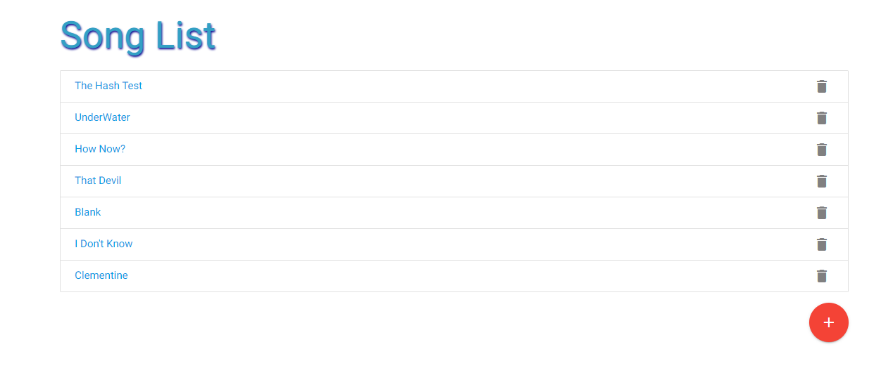
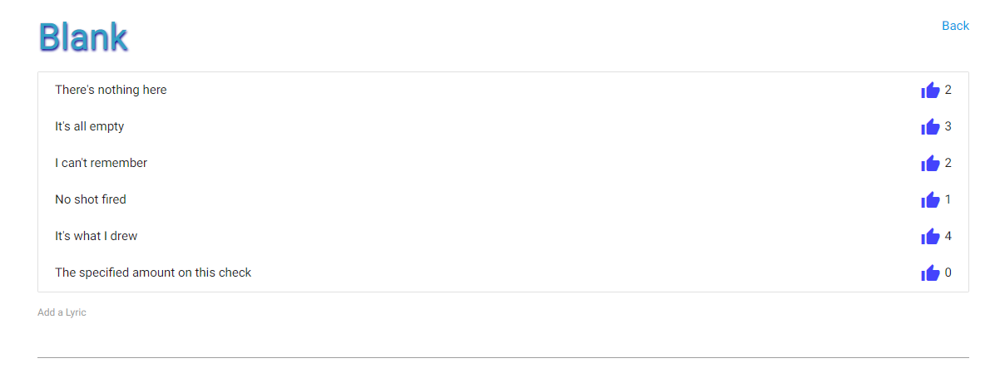

# **Songs and Lyrics**

## **Purpose**

A simple web app that allows a user to create a song list and add lyrics with a like button to the songs in the list.

## **Table of Contents**

<a href="#installation">Installation</a>

<a href="#usage">Usage</a>

<a href="#userLicense">License</a>

<a href="#contributions">Contributions</a>

<a href="#tests">Tests</a>

<a href="#questions">Questions</a>

## <h2 id="installation">**Installation**</h2>

n/a

## <h2 id="usage">**Usage**</h2>

a fun song and lyric app

  
  
  
  ## <h2 id="userLicense">**License**</h2>
  ### <em>NOTICE</em>:
  This application is covered under the 
  Unlicense license.  
  More info can be found here:
  https://unlicense.org/

## <h2 id="contributions">**Contributions**</h2>

No contributions at this time

## <h2 id="tests">**Tests**</h2>

n/a

## <h2 id="questions">**Questions**</h2>

For additional information please contact me via email:

zaceitel@gmail.com

or visit my github page:

https://github.com/Zeitel42
